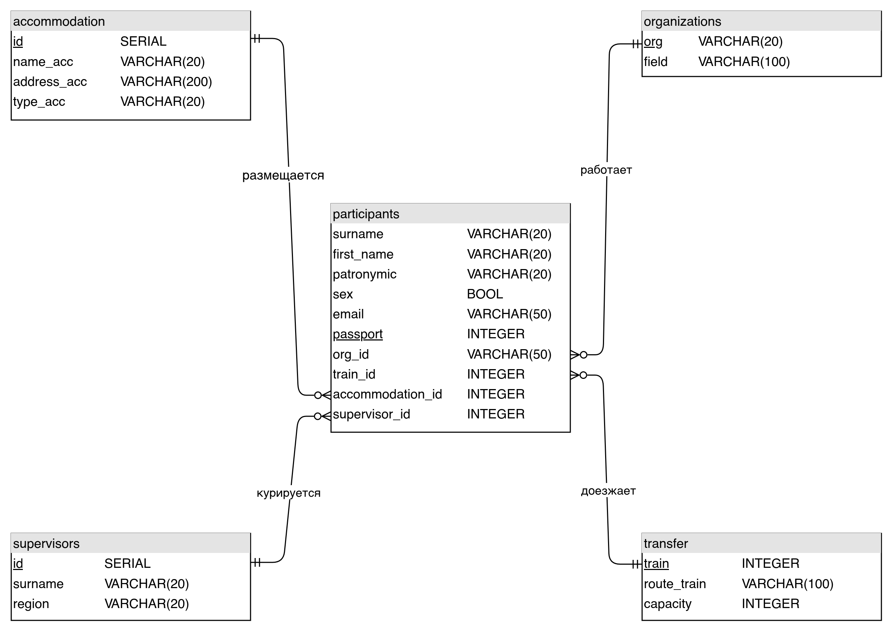

# Модели базы данных

## Концептуальная модель

Диаграмма, состоящая из значащих таблиц и связей между ними.

## Логическая модель

Диаграмма, разбитая на детализированные сущности согласно выбранной модели данных и нормализации.

## Физическая модель

Определение всей атрибутов всех таблиц схемы с указанием типа данных и всех ограничений.

[Ссылка на модель](physical_model.md)
